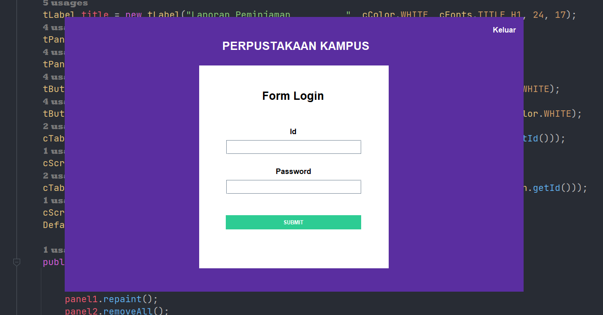

SIMPLE PERPUSTAKAAN ONLINE BERBASIS GUI DENGAN BAHASA PEMEROGRAMAN JAVA

- SAYA MENGGUNAKAN JDK 17
- PERPUSTAKAAN INI MENGGUNAKAN DATABASE MYSQL ONLINE, JIKA INGIN OFFLINE SILAHKAN GANTI KONFIGURASI NYA DAN DOWNLOAD
  FILE DATABASENYA DI FOLDER ASSETS
- JANGAN LUPA UNTUK MENDOWNLOAD JDBC DAN LIBRARINYA DI FOLDER ASSETS
- PERPUSTAKAN INI MULTI LOGIN : PETUGAS DAN MAHASISWA, JIKA KALIAN MENGGUNAKAN DATABASE ONLINE BERIKUT DATA LOGINNYA :
    - PETUGAS
        - ID - PASSWORD
        - (200009062022011001 - 123456789)
        - (200009062022021001 - 123456789)
        - (200009062022031001 - 123456789)

    - MAHASISWA
        - ID - PASSWORD
        - (202211420000 - 123456)
        - (202211420052 - 123456)
        - (202211420058 - 123456)
        - (202211420065 - 123456)
        - (202211420067 - 123456)
        - (202211420083 - 123456)
